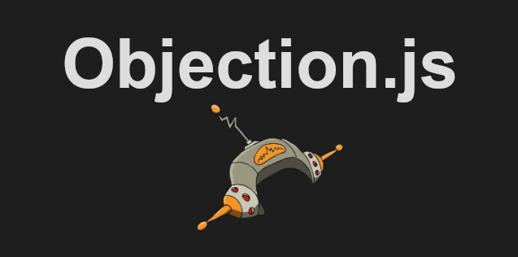

<header>
<h1 style=color:#206557ff>A Simple ObjectionJS/HapiJS Application</h1>
</header>
<body>

This is a very basic backend application that is designed to provide a basic project off of which one can scaffold the tools utilized in KnexJS and ObjectionJS for quickly setting up a MySQL (or Postgres) database and a HapiJS server.  The Project utilizes a variety of HapiJS and HapiPal plugins (listed below).

<h5 style=color:#206557ff>Clone and install the Project</h5>

`git clone https://github.com/tomit4/hapijs_glue_objection.git`

`npm install`

`systemctl start mariadb`

`mariadb -u your_db_user_name -p`

`CREATE DATABASE your_db_name;`

`\q`

<h5 style=color:#206557ff>Create a .env file:</h5>

For security purposes, creating a .env file will pass sensitive login information to the server, first create the file:

`touch .env`

And enter the following, each input on its on new line (no punctuation at the end of each line, be sure to put in your own mariadb username and password):

`HOST=localhost`

`PORT=3000`

`DB_TYPE=mysql`

`DB_HOST=localhost`

`DB_PORT=3306`

`DB_USER=your_db_user_name`

`DB_PASS=your_db_user_password`

`DB_NAME=your_db_name`

<h5 style=color:#206557ff>Migrating and Seeding</h5>

KnexJS requires that you migrate your table schematics and seed your (mock) data before starting the server

`knex migrate:latest`

`knex seed:run`

Alternatively, you can also enter:

`npm run migrate`

`npm run seed`

<h5 style=color:#206557ff>Start the HapiJS/Glue Server</h5>

`npm run glue`

<h5 style=color:#206557ff>Navigate in the Browser to See your Data</h5>

Open up your favorite browser and navigate to one of the three options below to see your data displayed

`http://localhost:3000/api/usa`

`http://localhost:3000/api/mexico`

`http://localhost:3000/api/canada`

<h5 style=color:#206557ff>A Note on Objection's Models/Relations</h5>

ObjectionJS's power has less to do with it's query() capabilities (although it is nicer than plain KnexJS) and more to do with its abilities to simplify the syntax around complex SQL queries like JOIN.  This project doesn't really demonstrate those capabilities, but instead provides a basic scaffolding on which one can gain an understanding on the essentials of ObjectionJS's models/relations.  Within the models directory, this is clearly demonstrated in the cities.js file, where a basic Model.BelongsToOneRelation is established, and then called in our routes.js file with the withGraphFetched() method.

A wide variety of tutorials and documentation was followed in order to gain this basic understanding of ObjectionJS, for while the documentation on KnexJS, ObjectionJS, and HapiJS is quite good, there are few tutorials that explain how to piece a basic project like this together.  I have taken the liberty of providing some basic instructions on how to set up a very basic knex/objection installation, and also some links to further reading/tutorials below.

<h5 style=color:#206557ff>Installation</h5>

`npm init -y`

`npm install -g knex` (necessary)

`npm install knex --save`

`npm install objection/@next` (@next is necessary)

`npm install mysql`

`npm install @hapipal/glue`

Other packages of note are of course, nodemon and dotenv, as well as exiting, joi, and @hapipal/confidence (see the package.json for a full list of what was used).

<h5 style=color:#206557ff>A Note on Schwifty</h5>

Those of you who are more familar with the HapiJS landscape than I may ask, "Wait, why didn't he just use @hapipal/schwifty?"  And you'd be right.  Unfortunately, at the time of this writing, @hapipal/schwifty's installation threw me dependency related errors in regards to its compatibilities with KnexJS.  The same errors were thrown when installing ObjectionJS, but I was able to circumvent it by installing the "beta" version using /@next.  I have played around with @hapipal/schwifty and think it's a great package, but in the pursuit of getting through this project with a good understanding of the core concepts behind ObjectionJS, I opted to use that instead.

<h5 style=color:#206557ff>Creating Migrations and Seeds</h5>

`knex init` (make sure to edit the created knexfile.js)

`touch db/knex.js` (see knex.js sample in our db directory)

`knex migrate:make 01-table-name`

`knex seed:make 01-table-name`

Hopefully this simple project will help demonstrate to somebody who is interested in using this particular stack one way of getting started.  Thanks for reading!  And I hope you're @Hapi!

<h5 style=color:#206557ff>Helpful Links</h5>

<a href="https://hapi.dev/">HapiJS</a>

<a href="https://hapipal.com/">HapiPal</a>

<a href="https://knexjs.org/">KnexJS</a>

<a href="https://vincit.github.io/objection.js/">ObjectionJS</a>

<a href="https://www.youtube.com/watch?v=r-ieNv8-mr4">ExpressJS/ObjectionJS Tutorial by Kyle Coberly</a>

<a href="https://www.youtube.com/watch?v=2Mnn29KRzEI">Slideshow Presentation on ObjectionJS Models/Relations by Tom Nurkkala</a>

<h5 style=color:#206557ff>A Note on Hapi-Swagger</h5>

I have implemented a charming documentation GUI API that allows you to test the applications interface.  An interesting project called Hapi-Swagger which is designed to provide the developer an easy way to test their api (similar to Postman). If you wish to use this tool, while the Glue server is running, simply navigate to:

`http://localhost:3000/documentation`

<a href="https://github.com/glennjones/hapi-swagger">Hapi-Swagger</a>

_Please note that this project was written by a beginner, it is my best attempt at creating a backend HapiJS/Knex/Objection project._
